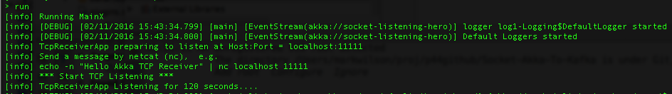
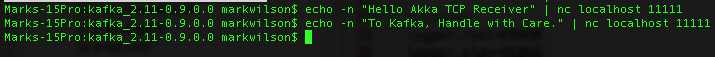
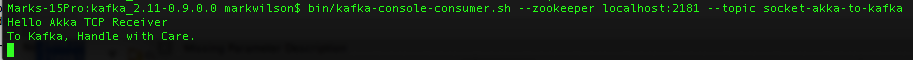

# Socket-Akka-To-Kafka

TCP socket listener in Akka publishes to Kafka.

Simple app, No UI

This example uses
--------------

* Scala 2.11.7
* Akka 2.2.4  [Akka Home](http://akka.io/)
* Kafka 0.9.0.0  [Kafka Home](http://kafka.apache.org/)
* Sbt 0.13.8

About the App
--------------

Uses Akka IO to bind to a localhost port and listen for bytes.  ByteStrings are sent to a handler actor that produces to a Kafka topic.

Supports TCP (possibly in the future UDP too)

Requirements and How to Run
--------------

Kafka 0.9.0.0 installed.

Follow the [Kafka Quickstart Guide](http://kafka.apache.org/documentation.html#quickstart) to use the defaults to run kafka locally

Create the topic

> $ bin/kafka-topics.sh --create --zookeeper localhost:2181 --replication-factor 1 --partitions 1 --topic socket-akka-to-kafka

View the topic

> $ bin/kafka-topics.sh --list --zookeeper localhost:2181

Run the app from sbt by using 'run'

The Akka socket listeners should be running.

From a command line send a message with netcat, e.g.

> $ echo -n "Hello Akka TCP Receiver" | nc localhost 11111

Start a consumer

> $ bin/kafka-console-consumer.sh --zookeeper localhost:2181 --topic socket-akka-to-kafka

Sending TCP strings:

Listening to the topic:

License
--------------
This application is provided under the Apache 2 License

